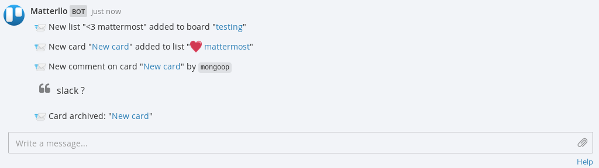

.. title:: Matterllo

|Matterllo|
===========

`Matterllo <https://github.com/Lujeni/matterllo>`_ is a simple integration between `Trello <https://trello.com>`_ and `Mattermost <https://mattermost.com>`_ using `Flask <https://flask.pocoo.org>`_ to send Trello activity notifications to Mattermost channels.

.. toctree::
   :maxdepth: 1

   usage.rst

.. toctree::
   :maxdepth: 3

   requirements.rst
   settings.rst

.. toctree::
   :maxdepth: 3

   development.rst
